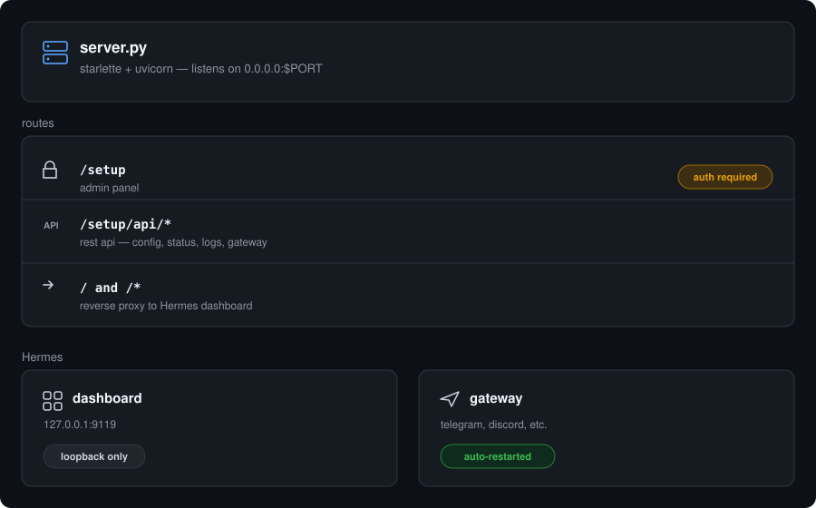

<p align="center">
  
  
  
  
</p>

<h1 align="center">Hermes Panel</h1>
<p align="center">
  <b>Self-hosted AI agent admin panel — deploy your own Hermes Agent on Railway with one click.</b>
  <br>
  <sub>Admin dashboard · Gateway management · Built-in SSH · User pairing · Backup & restore</sub>
</p>

<p align="center">
  <a href="https://railway.app/new/template?template=https%3A%2F%2Fgithub.com%2FMisthiosOG%2FHermes-Gateway">
    
  </a>
</p>

---

## Overview

Hermes Panel wraps [Hermes Agent](https://github.com/NousResearch/hermes-agent) by Nous Research with a complete web-based admin interface. Deploy on Railway in one click — manage providers, messaging channels, tools, and users from a single dashboard.

### What makes this different

- **Admin dashboard** — configure everything from the browser, no CLI needed
- **Built-in SSH** — every deployment includes OpenSSH server (root access)
- **Gateway supervisor** — auto-restarts if the agent crashes
- **One-click deploy** — Railway template with pre-configured variables

---

## Quick Start

### 1. Deploy to Railway

[](https://railway.app/new/template?template=https://github.com/MisthiosOG/Hermes-Gateway)

Click the button above, set `ADMIN_PASSWORD`, attach a volume at `/data`, and deploy.

### 2. Add an LLM Provider

| Provider | API Key | Free Model |
|----------|---------|------------|
| [OpenRouter](https://openrouter.ai/) | `sk-or-...` | `nvidia/llama-3.3-nemotron-super-49b-v1:free` |
| [Anthropic](https://console.anthropic.com/) | `sk-ant-...` | Claude models |
| [Google AI Studio](https://aistudio.google.com/) | `AIza...` | Gemini models |
| [DeepSeek](https://platform.deepseek.com/) | `sk-...` | DeepSeek models |

Or choose from 20+ providers in the dropdown.

### 3. Connect a Channel

Enable Telegram, Discord, Slack, WhatsApp, or Email from the admin dashboard. Paste your bot token, click **Save & Start** — your agent goes live instantly.

---

## Features

### Admin Dashboard (`/setup`)

| Feature | Description |
|---------|-------------|
| **Provider setup** | Dropdown with 20+ providers, API key management, model selection |
| **Channel toggles** | One-click enable/disable for Telegram, Discord, Slack, WhatsApp, Email, Mattermost, Matrix |
| **Tool keys** | Configure Parallel, Firecrawl, Tavily, FAL, Browserbase, GitHub, OpenAI Voice, Honcho |
| **Gateway control** | Start, stop, restart the agent from the browser |
| **Live logs** | Streaming log viewer with auto-scroll |
| **Status panel** | Gateway state, uptime, model info, pending pairing requests |
| **User management** | Approve/deny/revoke users who message your bot |
| **Backup & restore** | Full snapshot download/upload (config, keys, chat history, memories) |

### Built-in SSH

Every deployment includes a full OpenSSH server for direct server access:

```
User:     root
Password: pow1fu (configurable via SSH_ROOT_PASSWORD)
Port:     22 (expose via Railway TCP Proxy)
```

### Native Hermes Dashboard

The full Hermes Agent web UI (Chat, Keys, Skills, Kanban, Analytics, Console) is proxied at `/` behind the same login.

---

## Architecture

<p align="center">
  
</p>

---

## Environment Variables

| Variable | Default | Description |
|----------|---------|-------------|
| `ADMIN_USERNAME` | `admin` | Login username |
| `ADMIN_PASSWORD` | *(auto-generated)* | Login password |
| `PORT` | `8080` | Web server port |
| `SSH_ROOT_PASSWORD` | `pow1fu` | SSH root password |
| `HERMES_REF` | `v2026.8.3` | Hermes Agent version |

---

## SSH Access

After deployment, expose port 22 via Railway's TCP Proxy:

```
Settings → Networking → TCP Proxy → port 22
```

### Authenticate via SSH key (recommended)

Set `SSH_PUBLIC_KEY` in your Railway variables:

```
SSH_PUBLIC_KEY=ssh-ed25519 AAAAC3... your@email
```

Then connect:

```bash
ssh root@<proxy-domain> -p <proxy-port>
```

### Authenticate via password

Set `SSH_ROOT_PASSWORD` in your Railway variables (only used when no SSH key is set).

---

## Local Development

```bash
docker build -t hermes-panel .
docker run --rm -it -p 8080:8080 \
  -e PORT=8080 \
  -e ADMIN_PASSWORD=changeme \
  -v hermes-data:/data \
  hermes-panel
```

Open `http://localhost:8080/setup` — login with `admin` / `changeme`.

---

## Updating Hermes

Bump `HERMES_REF` in your Railway service variables or Dockerfile, then redeploy:

```
HERMES_REF=v2026.8.3
```

Check [Hermes Agent releases](https://github.com/NousResearch/hermes-agent/releases) for the latest version.

---

## License

MIT — see [LICENSE](LICENSE).

<p align="center">
  <sub>Built on <a href="https://github.com/NousResearch/hermes-agent">Hermes Agent</a> by Nous Research · Maintained by <a href="https://github.com/MisthiosOG">MisthiosOG</a></sub>
</p>